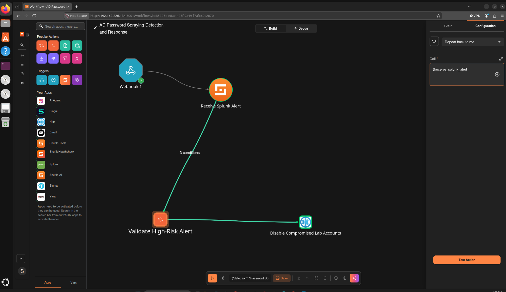
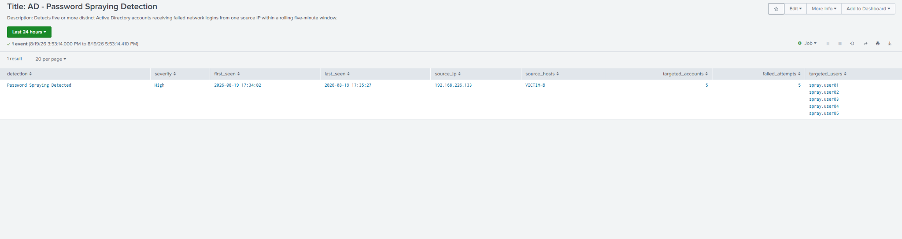
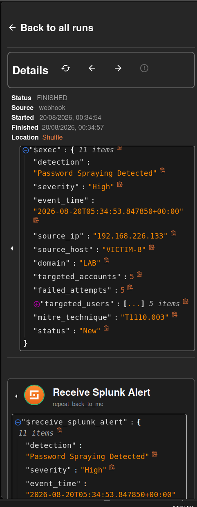
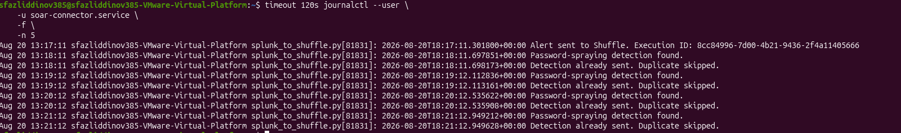
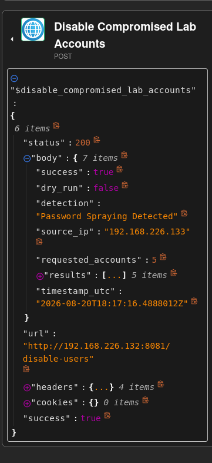
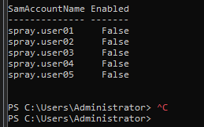
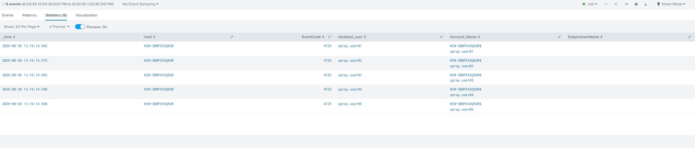

# Automated Identity Attack Detection and Response

I built this lab because I wanted to understand what happens after a SIEM detects an identity attack—not just stop at the alert. Splunk detects a password-spraying pattern against five Active Directory test accounts, a Python connector sends the detection to Shuffle SOAR, and a restricted Windows responder disables only those approved lab accounts.

The final step verifies that the response actually happened by searching Splunk for Windows Security Event ID `4725`, which is generated when an account is disabled.

> **Project status:** Successfully completed and tested end to end on August 20, 2026.



## Technologies used

- Splunk Enterprise
- Shuffle SOAR
- Microsoft Active Directory
- Windows Security Event Logs
- Splunk Universal Forwarder
- Python
- PowerShell
- Docker
- VMware Workstation
- Ubuntu Server
- Windows Server 2022

## What the lab does

- Collects Windows Security logs from an Active Directory domain controller
- Detects one source attempting to authenticate against five different accounts
- Correlates failed logons inside a rolling five-minute window
- Maps the activity to **MITRE ATT&CK T1110.003 — Password Spraying**
- Sends the detection from Splunk to Shuffle SOAR automatically
- Validates the alert before permitting a response
- Disables only allowlisted lab accounts
- Suppresses duplicate alerts to prevent repeated response actions
- Confirms containment using Windows Security Event ID `4725`

## Lab architecture


| System | Role in the lab | IP address |
| --- | --- | --- |
| VICTIM-B | Generates controlled failed-logon events | `192.168.226.133` |
| DC-01 (`WIN-3B0FE43Q9UR`) | Active Directory, DNS, and Windows Security logs | `192.168.226.132` |
| SIEM-01 | Splunk Enterprise and the Python connector | `192.168.226.129` |
| SOAR-01 | Shuffle SOAR running in Docker | `192.168.226.134` |

All four systems were connected to an isolated VMware network. The addresses shown above are private lab addresses included to make the project easier to understand and reproduce.

## Password-spraying detection

The controlled test uses an incorrect password against five purpose-built Active Directory users. The domain controller records the failed network logons as Event ID `4625`.

Splunk looks for the following behavior:

1. Failed logons are recorded on the domain controller.
2. The attempts originate from the same source IP.
3. Five or more distinct lab accounts are targeted.
4. The attempts occur within a rolling five-minute window.

The complete SPL detection is available in [`splunk/password-spraying-detection.spl`](splunk/password-spraying-detection.spl).



## SIEM-to-SOAR workflow

```text
Failed logons are generated from VICTIM-B
        ↓
DC-01 records Windows Security Event ID 4625
        ↓
Splunk correlates the failed logons on SIEM-01
        ↓
The Python connector checks Splunk every 60 seconds
        ↓
The connector sends one authenticated alert to Shuffle
        ↓
Shuffle validates the detection and its severity
        ↓
Shuffle calls the restricted responder on DC-01
        ↓
The five approved lab accounts are disabled
        ↓
DC-01 records Event ID 4725
        ↓
The response events are forwarded back to Splunk
```

This project uses both SIEM and SOAR:

- **Splunk SIEM** collects the logs and detects the password-spraying pattern.
- **Shuffle SOAR** receives the alert, validates it, and coordinates the automated response.

## Response validation

Shuffle allows the response action to continue only when all three conditions are true:

- `severity == "High"`
- `targeted_accounts > 4`
- `detection == "Password Spraying Detected"`

If one of these checks fails, the account-disable action does not run.

## Safety controls

Automatically disabling accounts can be risky, so I added several controls to limit what the responder is allowed to do:

- Splunk-to-Shuffle and Shuffle-to-responder connections use separate authentication keys.
- Secrets are stored outside the repository.
- Windows Firewall restricts the responder port to SOAR-01.
- The responder accepts only five exact test usernames.
- Each user must belong to the dedicated `SOAR-Lab-Users` organizational unit.
- Shuffle checks the detection name, severity, and account count before responding.
- The public responder configuration starts in dry-run mode.
- Every response request is written to an audit log.
- The Python connector stores a detection fingerprint to prevent duplicate workflow executions.

Additional information is available in [`docs/security-controls.md`](docs/security-controls.md).

## Final test results

During the final end-to-end test:

- Splunk correlated five failed logons against five different accounts.
- The Python connector sent one authenticated alert to Shuffle.
- Later polling cycles recognized the same detection and skipped it as a duplicate.
- Shuffle returned HTTP `200` with `success: true`.
- The response showed `dry_run: false`, confirming that live response was enabled.
- The responder disabled all five allowlisted lab accounts.
- Splunk received five Event ID `4725` events confirming the account changes.

| Stage | Evidence |
| --- | --- |
| Splunk detection | [Password-spraying detection](evidence/01-splunk-password-spraying-detection.png) |
| Shuffle alert ingestion | [Alert received by Shuffle](evidence/02-shuffle-alert-received.png) |
| Automatic connector | [Delivery and duplicate suppression](evidence/03-automatic-connector-deduplication.png) |
| Shuffle response | [Successful automatic response](evidence/04-shuffle-automatic-response.png) |
| Active Directory containment | [Disabled lab accounts](evidence/05-active-directory-accounts-disabled.png) |
| Splunk audit verification | [Event ID 4725 results](evidence/06-splunk-response-audit-4725.png) |
| Completed SOAR workflow | [Final workflow architecture](evidence/07-final-workflow-architecture.png) |

## Evidence walkthrough

### 1. Splunk detects the password spray

Splunk correlated failed logons from `192.168.226.133` against five different Active Directory accounts.


### 2. Shuffle receives the alert

The authenticated webhook delivered the detection name, severity, source address, targeted users, and MITRE ATT&CK technique to Shuffle.



### 3. The connector suppresses duplicates

The Python connector sent the first detection to Shuffle and skipped later copies of the same result.



### 4. Shuffle performs the automatic response

After all three validation checks passed, Shuffle called the restricted Windows responder. The responder returned HTTP `200`, `success: true`, and `dry_run: false`.



### 5. Active Directory accounts are disabled

The five allowlisted `spray.user` accounts were confirmed as disabled in Active Directory.



### 6. Splunk verifies the containment action

The domain controller generated five Event ID `4725` events, confirming that the account-disable actions occurred.



### 7. Completed SOAR workflow

The final workflow connects the authenticated webhook, alert ingestion, three validation conditions, and the account-containment response.


## Problems I ran into

The lab required a fair amount of troubleshooting. The main problems I encountered were:

- The target username was stored inside Splunk's multivalue `Account_Name` field instead of the field I originally expected.
- The virtual machines were using different time zones, which caused recent events to appear outside the Splunk search window.
- The first Shuffle execution remained in the `EXECUTING` state because the Docker worker could not resolve other services on the Swarm network.
- The HTTP application service had to be added to the correct Docker overlay network.
- Splunk continued returning the same rolling-window result, so I added fingerprint-based duplicate suppression.
- An HTTP `200` response did not prove that containment happened, so I verified the result separately in Active Directory and through Event ID `4725`.

More detailed troubleshooting notes are available in [`docs/lessons-learned.md`](docs/lessons-learned.md).

## Repository structure

| Directory | Contents |
| --- | --- |
| `splunk/` | Password-spraying detection and response-audit SPL |
| `connector/` | Python Splunk-to-Shuffle connector and systemd service |
| `shuffle/` | Sanitized Shuffle workflow reference |
| `windows-responder/` | Restricted Active Directory response service |
| `testing/` | Controlled simulation and verification scripts |
| `docs/` | Architecture, implementation, testing, controls, and lessons learned |
| `diagrams/` | Lab architecture diagram |
| `evidence/` | Screenshots from the completed test |

## Reproducing the lab

This repository documents a completed cybersecurity lab rather than providing a one-command production installer.

Review the component guides in the following order:

1. [`splunk/README.md`](splunk/README.md)
2. [`connector/README.md`](connector/README.md)
3. [`shuffle/README.md`](shuffle/README.md)
4. [`windows-responder/README.md`](windows-responder/README.md)
5. [`testing/README.md`](testing/README.md)

The broader implementation process is documented in [`docs/implementation.md`](docs/implementation.md).

## What I would change for production

This project was built on an isolated network and used self-signed certificates and internal HTTP communication.

For a production environment, I would add:

- Trusted TLS certificates
- A centralized secrets manager
- Dedicated service accounts with minimum required permissions
- Approval gates for high-impact response actions
- Centralized and protected response logs
- Rate limiting
- High availability
- Additional detection tuning to reduce false positives
- Recovery procedures for accounts disabled incorrectly


## Author

**Sarvarbek “Bek” Fazliddinov**  
Information Security Graduate Student at Georgia Tech
