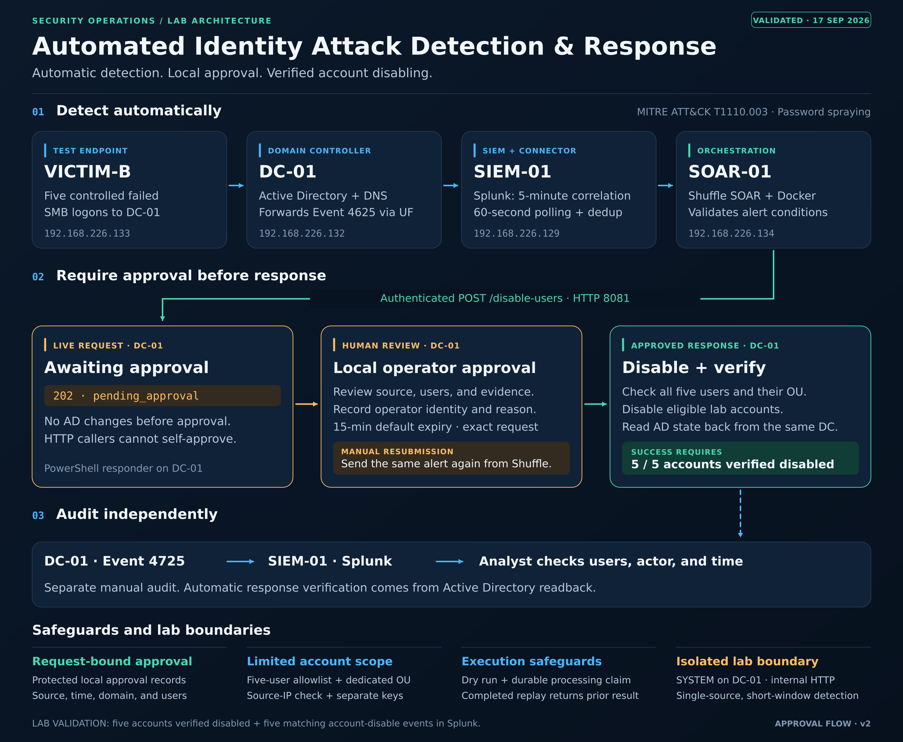

# Architecture

The current lab automates detection and account response, with local operator
approval required before account changes. The responder verifies account state
in Active Directory; the Event 4725 check in Splunk is a separate manual audit.

[Scalable SVG](../diagrams/architecture-diagram.svg) ·
[Observed lab results and screenshots](validation-2026-09-17.md)

## Network design

The four VMs share the isolated `192.168.226.0/24` lab network.

| Host | Address | Function and key services |
| --- | --- | --- |
| VICTIM-B | `192.168.226.133` | Controlled failed SMB logons against the five lab users |
| DC-01 | `192.168.226.132` | AD DS, DNS, Windows Security logs, PowerShell responder on TCP 8081 |
| SIEM-01 | `192.168.226.129` | Splunk, Universal Forwarder receiving port 9997, Python connector |
| SOAR-01 | `192.168.226.134` | Shuffle SOAR in Docker, authenticated webhook ingestion |

## Detection and response

1. VICTIM-B generates controlled failed SMB authentication attempts. DC-01 records
   Event 4625, and its Universal Forwarder sends the logs to Splunk.
2. Splunk correlates five distinct lab accounts from one source within a rolling
   five-minute window. The Python connector polls every 60 seconds and sends a
   qualifying detection to the authenticated Shuffle webhook.
3. Shuffle checks detection name, severity, and account count, then submits the
   alert to the DC responder using a separate response key. A live request without
   approval returns HTTP 202, `pending_approval`, with no account changes.
4. An administrator reviews the pending request locally on DC-01 and approves
   its exact source, event time, domain, detection, and user set. The record
   includes the operator, reason, and expiration (15 minutes by default).
5. The operator explicitly resubmits the unchanged alert from Shuffle. Recording
   approval does not resume a workflow or disable accounts by itself.
6. The responder checks the approval and all five users' OU membership, records
   a durable processing claim, disables eligible accounts, and reads each
   account's state back from the same DC. Only five confirmed disabled accounts
   produce `success=true` and `status=verified`.
7. Windows records Event 4725 for account-disable actions. These events are
   forwarded to Splunk and manually checked against users, actor, and timestamps.
   This audit is independent of the responder's automatic AD readback.

## Trust boundaries and limitations

- **Detection access:** The SIEM connector uses Splunk REST credentials. Its
  stored last-delivery fingerprint suppresses a repeated alert, but is not a
  durable queue or a general deduplication history.
- **Integration authentication:** Shuffle ingestion and DC response use separate
  keys. The responder also restricts request source IP to SOAR-01. Its internal
  HTTP connection does not encrypt the response key or payload.
- **Local approval:** HTTP callers cannot grant approval. Protected local files
  bind a time-limited approval to the exact request; the operator resubmits it.
- **Account scope:** The responder requires exactly `spray.user01` through
  `spray.user05` in the dedicated lab OU. These are application checks; the task
  still runs as SYSTEM on the DC, not an AD-delegated least-privilege identity.
- **Verification and replay:** Completed responses contain AD readback evidence.
  Repeating a completed request returns its historical result, not a new state
  check. Interrupted processing requires review instead of automatic replay.
- **Detection coverage:** The single-source pattern and short window are narrow;
  the query returns only the latest qualifying result. Slow or distributed
  spraying can fall outside this lab's coverage.

## Availability

The connector runs as an enabled systemd user service. The Windows responder
runs as a scheduled task under SYSTEM at startup. Shuffle runs in Docker.
These process states do not by themselves prove successful detection delivery or
response; see the dated live validation record for the demonstrated core flow.

## Historical architecture

The [original v1 diagram](../diagrams/architecture-diagram-v1.png) documents the
previous direct-response design. It is preserved only as historical evidence;
the current architecture is the approval flow at the top of this page.
