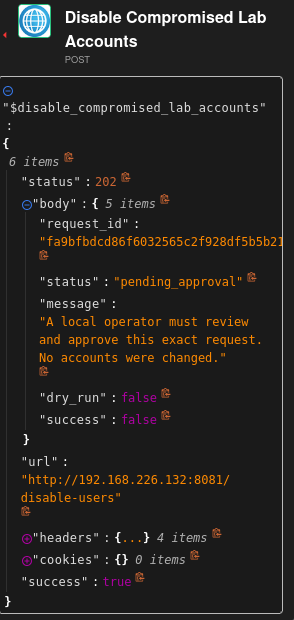
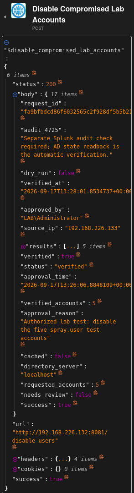
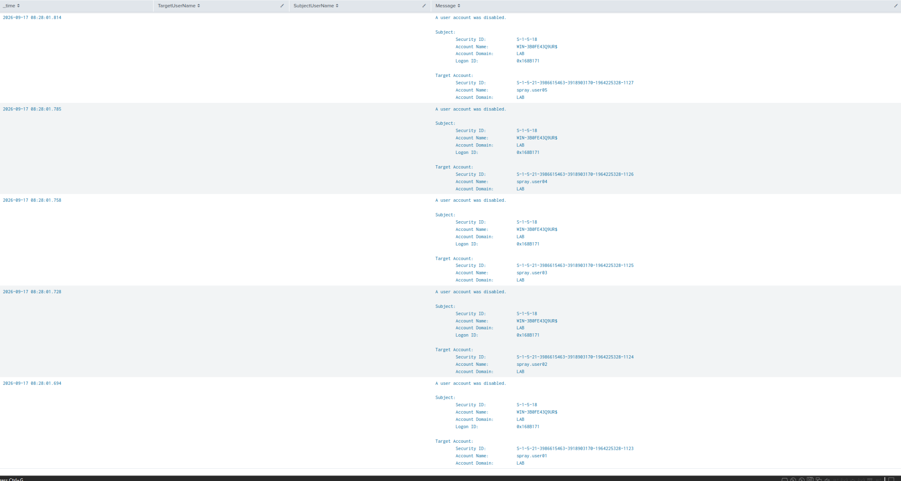

# VMware lab validation — 2026-09-17

Responder revision: `c356035b4dd0851e72810dd557eb010b33e22bd5`.
This record summarizes operator-provided terminal output, Shuffle execution
results, and the original Shuffle/Splunk screenshots captured during validation. It is not an
independent remote examination of the VMs.

## Observed flow

- DC-01 forwarded fresh Windows logs into Splunk after the VM pause.
- Five controlled failed logins from VICTIM-B (`192.168.226.133`) produced
  a detection targeting `spray.user01` through `spray.user05`.
- Shuffle webhook execution `9da05c60-44da-40a4-a4bb-5d8fd8c6fbb0`
  began at 08:12:19 CDT. Its event time was 13:12:13.661 UTC and it
  reported five failed attempts against five accounts. The responder returned
  HTTP 200, `status=dry_run`, `verified=false`, with no changes reported.
- After enabling live mode, the same alert was replayed at 08:25:05 CDT.
  HTTP 202 returned `pending_approval` and reported no account changes.
- `LAB\Administrator` approved the exact request at 13:26:06.8848109 UTC,
  expiring at 13:41:06.8848109 UTC, with reason:
  "Authorized lab test: disable the five spray.user test accounts".
- The unchanged alert was replayed at 08:27:56 CDT. The response was HTTP 200,
  `status=verified`, `success=true`, `verified=true`, `cached=false`,
  `requested_accounts=5`, `verified_accounts=5`, and `needs_review=false`.
  AD readback used `localhost`; verification time was
  13:28:01.8534737 UTC.

Request ID throughout approval and live execution:
`fa9bfbdcd86f6032565c2f928df5b5b2187bd57ab694b75f3e4786267c3e9162`.

## Separate Windows audit evidence

The operator searched Splunk for EventCode 4725 on `WIN-3B0FE43Q9UR`.
The provided screenshot showed "A user account was disabled" for each target:

| Target | Splunk displayed time (CDT) |
| --- | --- |
| spray.user01 | 2026-09-17 08:28:01.694 |
| spray.user02 | 2026-09-17 08:28:01.728 |
| spray.user03 | 2026-09-17 08:28:01.758 |
| spray.user04 | 2026-09-17 08:28:01.785 |
| spray.user05 | 2026-09-17 08:28:01.814 |

The event subject was SYSTEM (SID `S-1-5-18`), with the DC machine account
`WIN-3B0FE43Q9UR$`; this is the execution identity, distinct from the approving
operator. TargetUserName and SubjectUserName table columns were blank, but the
raw Message contained the actor and target accounts. Audit verification was
manual; the responder automatically verified AD state only.

## Captured screenshots

These are the operator's original captures, copied without image edits. The
narrow Shuffle captures truncate long request IDs; the complete ID above comes
from the corresponding pasted execution output.

### Request awaiting approval

The live responder returned HTTP 202 and reported no account changes before
approval. `dry_run=false` distinguishes this from a preview. Shuffle's outer
`success=true` describes the HTTP action, not completed containment.

### Approved and verified response

The response includes the approving operator, reason, and approval time, followed
by five verified accounts. Individual account results are collapsed in this
capture; the separate audit screenshot names all five affected accounts.

### Separate Splunk audit

The messages show five account-disable events, their target users, SYSTEM actor,
and timestamps matching the approved response. The screenshot is the results
table; the EventCode 4725 filter was supplied in the search used for this check.

## Configuration and limits

The deployed Shuffle HTTP body was changed to `$exec` after an isolated action
test returned "Missing alert field: detection" with the previous mapping.
A subsequent action test succeeded. The successful approved full workflow run
also contained the unchanged alert. Local approval and explicit resubmission
are manual steps, not a native Shuffle approval/resume interface.

This validates the core approval and containment flow, not the entire live
integration checklist. Live forged-approval, wrong-key/source, expiry,
partial-failure, crash-recovery, and completed-request replay tests were not
shown. No separate post-containment Get-ADUser output was supplied; evidence
consists of responder readback plus the five independent audit events.
Production boundaries (SYSTEM on the DC, internal HTTP, narrow detection,
and limited connector deduplication) remain documented in the main guide.
